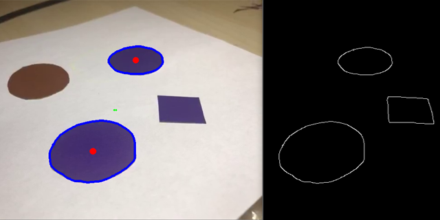

[](https://codebeat.co/projects/github-com-sencudra-rpi3-opencv-master)

## About project



Imagine two Raspberry's connected via sockets. The first one is a 'client', measuring distance with special gpio perherials (HC-SR04 Ultrasonic Sensor). This distance is transfering over "air" to the second Raspberry - server.  

The server does a bit more: while receiving values from client (multiple clients supported), it regulates the loudness of buzzer. What is more, the server in another thread receive image from all types of supported cameras and process it in some interesting way. The Server can detect purple circle objects and manipulate servo motor to keep objects always on center, hopefully.

## Requirements

Computer:
- Pytho 3.5+ installed
- Requiremets.txt install
- Webcam or ip-camera

Raspberry:
 - Two Raspberries with 2 microSD cards (one with no less than 32 GB size)
 - 2 HDMI and 2 screens
 - Major GPIO perepherials: distance sensor, servo motor, buzzer
 - Webcam or ip-camera

## Launch

This project could be run locally on your computer or with Raspberry Pi:  
- To run this project on your computer you need prepare your project environment and install all python dependencies from ```requirements.txt```. That's all.

 - To run this project on Raspberry Pi you need to have OS Raspbian be installed with OpenCV on board. The last is pretty painfull to compile. So you can download semi-ready-to-run microSD card image from [here](https://mega.nz/#!tGg3QaQS!nZuGcPtrfNS9L933MTME3qjIKH3uobs6odF4MgckdoA). Then you need to shrink image with a wonderfull tool [PiShrink](https://www.ostechnix.com/pishrink-make-raspberry-pi-images-smaller/). The image could be "burned" with Win32DiskImage, Rufus, etc.

**IMPORTANT**
All major settings could be and must be setup in ```config.py```.  

Also before running ```main_server``` and then ```main_client``` you need to setup ```ip:port```. For both client and server you need to specify in config file the **server's** ip and port.

## Troubleshooting

Feel free to contact me if comething is unclear or not working :)